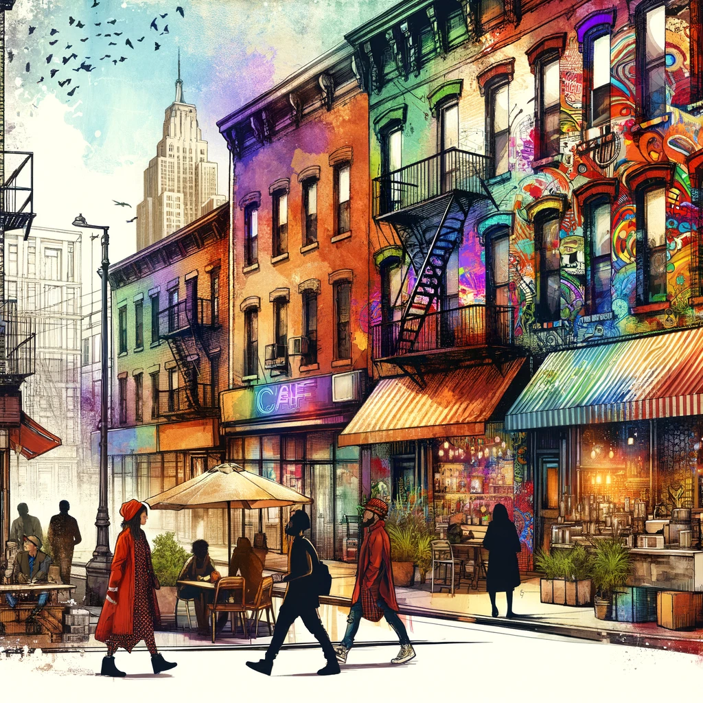

# Brooklyn Blog Platform

## Table of Contents

- [Project Overview](#project-overview)
- [Project Structure](#project-structure)
- [Setup](#setup)
- [Usage](#usage)
- [Contributing](#contributing)
- [License](#license)

## Project Overview

This project is a React-based web application designed to showcase blog entries about various topics, particularly focusing on the vibrant life in Brooklyn and the resurgence of vintage fashion.

## Project Structure

The application is structured into several main components, each responsible for a part of the website:

- `App.js`: The main React component that holds the state and passes it down to other components.
- `Homepage.jsx`: A component that displays all blog entries.
- `BlogEntries.jsx`: Responsible for rendering the list of blog entries.
- `BlogEntry.jsx`: A component for displaying a single blog entry.
- `Header.jsx` and `Footer.jsx`: Components for the website's header and footer.
- `index.js`: The entry point of the React application.

### Styles

- `App.css`: Contains styles specific to the `App` component.
- `index.css`: General styles that affect the root of the project.

## Setup

To get this project running locally, follow these steps:

1. Clone the repository:
   ```bash
   git clone [your-repository-url]
   ```
2. Navigate to the project directory:
   ```bash
   cd [project-folder]
   ```
3. Install dependencies:
   ```bash
   npm install
   ```
4. Run the application:
   ```bash
   npm start
   ```

## Usage

Once the application is running, you can view it in your browser at `http://localhost:3000`. The homepage will display all available blog entries, which you can browse through.

## Contributing

Contributions to this project are welcome. Please ensure to update tests as appropriate.

## License

[MIT](https://choosealicense.com/licenses/mit/)
